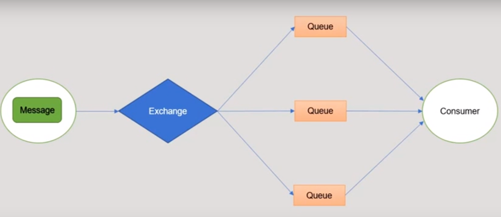
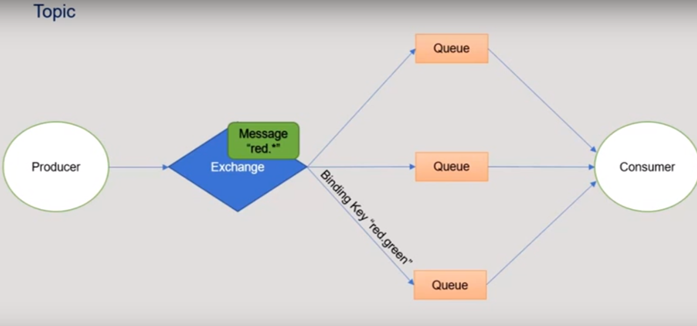

<h1>Seção 01 - Introdução ao RabbitMQ</h1>

<h2>O que é RabbitMQ</h2>

* O message broker mais utilizado.
* Código aberto
* Leve e fácil de fazer o deploy
* Suporta diferentes protocolos de mensagem
* Pode ser feito o deploy em clusters para alta escalabilidade e disponibilidade. Necessário em solutions empresarias.
* Usado pelo Google, VMWare e Mozilla.

<h2>Principais características</h2>

* Level de confiabilidade variável, geralmente configurando uma maior confiabilidade irá reduzir a performance. Isso pode ser gerenciado como preferido.

* Capacidade complexa em encaminhar mensagens.

* Diferentes configurações para propositos de mensagens.

<h2>Conceitos do RabbitMQ</h2>

* Primeiro é o producer, o intuito dele é enviar uma mensagem na fila, qualquer tipo de mensagem.
* A fila é onde as mensagens ficarao armazenadas, vinda do producer.
* Consumer serve para consumir, ele retira a mensagem da fila. Pega a informação da fila.

* Publisher envia a mensagem para o Exchange, depois envia para as filas depois o consumidor recebe das filas a mensagem.
* O Exchange é um aterfato do Rabbit para rotear essa mensagem.
* Ele escolhe para qual lugar a mensagem deverá ir com uma chave de ligação (binding key).

* Existe a mensagem, onde existe o corpo dela
* O Routing Key serve como label e indica onde a mensagem tem que passar.
* Routing Key vai para a direção do binding Key e vai para o consumir

* Entre os Binding Keys temos 4 exemplos
<h2>Fanout</h2>
* O primeiro é o Fanout - Basicamente o RabbitMQ que não tem nenhum Binding Key, não especifica onde a mensagem tem que passar, aleatoriamente. Todas serão enviadas para consumer

<h2>Direct</h2>
* Ela envia uma mensagem por apenas uma fila, ex: No Rounting Key A e o Binding Key A vai para a direção onde a fila está.

<h2>Topic</h2>
* Resume a mensagem, por exemplo: Você envia um indicador red.* ele irá procurar entre as binding keys a palavra que comece com red.

<h2>Header</h2>
* Ele não usa Binding Key, apenas envia a mensagem. RabbitMQ normal, manda a mensagem A e envia para qualquer fila a mensagem A até o consumer.

<h2>Default (nameless) Exchange</h2>
* O Routing Key vai levar o nome da fila. Não existe Binding Key, apenas o nome da fila.
* Ao invés de utilizar o binding key você indica pela fila.

-------------------------------------------------------------------
<h1>Seção 02 - Instalando e configurando o RabbitMQ</h1>

* Primeiro passo: Instalar o Erlang

* Download e instalando o RabbitMQ de acordo com o seu sistema operacional. Isso se encontra no site do RabbitMQ.

<h2> Habilitando o Plugin de Gerenciamento do RabbitMQ</h2>
* Abrir o prompt do RabbitMQ
* O Plugin já está incluso por padrão na instalação do RabbitMQ, só precisa ser habilitado.
* rabbitmq-plugins enable rabbitmq_management (Comando para ser executado) 

<h2>Checkar que tudo está funcionando</h2>
* Apenas necessário acessar o http://localhost:15672 para carregar a o gerenciador em modo interface de usuário.
* Login e senha padrão são:
* Login: guest
* Senha: guest

----------------------------------------------------------------------
<h1>Seção 03 - Mensagens, Queues (Filas) e Exchanges (Trocas)</h1>

<h2>Mensagens ou Messages</h2>
* Uma mensagem é um blob binário de um dado que será gerenciado pelo RabbitMQ e pode ser distribuido pelas filas (Queues) e Exchanges.

* Producer é um termo genérico que utilizamos para dizer que produz a mensagem e envia para a fila/troca do RabbitoMQ.

* Consumer é o termo genérico que utilizamos para dizer que recebemos as mensagens do RabbitMQ.

<h2>Queues ou Filas</h2>

* É o local onde a mensagem seguirá e será armazenada no RabbitMQ.

* Parece com um grande Buffer Message

* Existe um limite de tamanho de mensagem.

<h2>Exchange</h2>

* Recebe as mensagens do Producer e empurra elas para as filas.

* Ele pode enviar para uma ou várias filas dependendo das configurações da rota.

<h2>Confirmador de mensagens</h2>

* Se a conexão falhar entre o servidor Rabbit e o client (producer ou consumer), as mensagens não serão processadas corretamente e será necessário um reenvio.

* Se o enviador não receber uma mensagem positiva (acknowledgement ou ack) antes da conexão falhar ele terá que recolocar a mensagem na fila.

* Existem diferentes configurações para confirmar mensagens, por exemplo ativar a o mode de confirmação automatica (enabling automatic acknowledgement mode) a mensagem será considerada confirmada logo que for enviada. Ativando o modo atira e esqueça (fire and forget mode).

* Irá diminuir a segurança das entregas das mensagens mas aumentar a taxa de transferência (throughput)

* Os consumer também podem enviar uma confirmação negativa para a mensagem, e instruir para que o message broker recoloque na fila.

* Tanto a confirmação negativa ou positiva podem ser enviadas em massa, setando a multiple flag do acknowledgement command para true.

* Protocol methods para acknowledgements:
	* basic.ack usado para confirmações positivas (positives acknowledgements).
	* basic.nack usado para confirmações negativas (negatives acknowledgements).
	* basic.reject também é usado para confirmações negativas mas é o único capaz de rejeitar uma mensagem por vez.
* O nome do comando exato irá depender das libs do client e das diferentes linguagens de programação.

<h2>Queues - Filas</h2>

* Por padrão, a ordem das mensagens em queues é First In First Out (FIFO).

* Entretanto, as filas podem ser configuradas com prioridades, onde cada mensagem será ordenada dependendo da sua prioridade de executar, que é setada no sender.

<h3>Durability ou Durabilidade</h3>

* Queues duraveis são persistidas para o disco e então sobrevivem quando reinicia o broker. As Queues que não são duráveis são chamadas de transient.

* Configurando uma fila como duravel não faz com que a mensagem a ser enviada seja duravel.

* O message sender pode configurar o delivery_mode property para a mensagem como persistent, onde irá persistir no disco e logo será recebida por uma fila duravel.

* Em casos de non-persistent messages também são escritos quando a memória é baixa. Entretanto, isso não os faz duravel.

<h3>Filas temporarias ou Temporary Queues</h3>

* Podem ser configuradas para serem excluidas de três formas:
	* Exclusive queues pode apenas ser usadas pelas suas conexões decladas, e será automaticamente deletada quando a conexão for fechada.
	* Tempo expirado (Expiry Time) ou também conhecida como tempo para viver (time to live) pode ser configurada para uma fila. Se a fila não for usadas nesse tempo configurado a fila será apagada.
	* Filas auto-deletaveis (Auto-delete queues) serão automaticamente deletadas uma vez que o ultimo consumer tiver cancelado o basic.cancel protocol or gone. (Exemplo: fechar conexão).

<h2>Demonstração</h2> 

* Na aba Queues poderá criar filas

* Escolher nome, durability, Auto delete e os arguments

* Você criar uma fila duravel e outra transient, você verá que quando o serviço do RabbitMQ for reiniciado, apenas a fila duravel irá permanecer.

--------------------------------------------------------------------------------------------------------
<h1>Seção 04 - Exchanges and Complex Routing (Rotas Complexas)</h1>

<h3>Exchange Types</h3>

* Exchanges recebem as mensagens do producer e empurram elas para as filas

* Pode ser configurado para enviar as mensagens para 0 ou mais queues.

* Existem quatro tipos de Exchanges
	* Fanout
	* Direct
	* Topic
	* Headers

<h3>Fanout Exchange</h3>

* O tipo Fanout roteia uma mensagem para todas as filas.

* Ignora qualquer routing key enviada com a mensagem.

<h3>Direct Exchange</h3>

* O tipo Direct Exchange roteia a mensagem com um routing key particular para as  filas que tem os exatos routing key.

<h3>Topic Exchange</h3>

* O tipo Topic Exchange você monta um padrão para routing key.

* As mensagens são publicadas com routing keys que contem uma ou mais palavras separadas por ponto (.). Ex: multi.word.test

* O padrão é:
	*  ('*') Significa que combina qual palavra em uma posição específica da routing key
	*  ('#') combina zero ou mais palavras.

* Exemplo: Uma mensagem publicada com routing key 'multi.word.test'
	* Ira combinar com filas com routing key 'multi.#', '*.word.*', 'multi.word.test', '#'
	* Mas não ira combinar com filas com routing key 'multi.*', 'single.#' ou 'multi.foo.test'

<h2>Headers Exchange</h2>

* Parecido com o Topic Exchange, mas o topic exchange combina com a routing key e o header exchange combina com o cabeçalho da mensagem (message header).

------------------------------------------------------------------------------------
<h2>Seção 5 - Plugins</h2>

<h2>Consistent-Hash Exchange Plugin</h2>

<h3>O que o Plugin faz?</h3>

* Adiciona novos tipos de exchange: the consistent-hash exchange.

* O consistent-hash exchange mede as mensagens enviadas para que um exchange é consistente e euqalmente distribuida para os limites das filas dependendo dos routing key das mensagens

* Isso significado que se duas mensagens possuem a mesma routing key, a consistent-hash exchange irá rotear elas para a mesma fila a menos que a ligação das filas tenha mudado o exchange.

* Se o número de filas do exchange mudar, o consistent-hash exchange irá distribuir rounting keys entre essas filas.

<h3>Configurações do Consistent-Hash</h3>

* Por padrão o consistent-hash exchange realiza o hashing no routing key message, mas também pode ser feito em:

* Message Properties: Declarando o exchange com o argumento "hash-property" e o valor do argumento como message_id, correlation_id ou timestamp.

* Message Headers: Declarando o exchange com o argumento "hash-header" e o valor do argumento como header name para ser usado pelo hashing.

* A relação entre o routing keys distribuidos entre as filas pode ser controlada mudando o valor do binding key da fila do exchange.

* Entretando, se você quiser que a fila A recebe duas vezes as muitas routing keys roteadas que são roteadas para a fila B, então você a fila A com o binding key de duas vezes o número.

<h2>Enabling the plugin</h2>

* Execute o comando
* rabbitmq-plugins enable rabbitmq_consistent_hash_exchange

-----------------------------------------------------------------------------
<h1>Seção 06 - Software Architecture Applications</h1>

<h2>Para que o RabbitMQ pode ser usado?</h2>

* Processamento Assyncrono

* Trabalho de filas, distribuindo o trabalho entre multiplos workers

* Publishing data para ser capturada em multiplos consumers inscritos para um exchange

* Handling Remote Procedure Calls de uma forma escalável.

<h2>Para que o RabbitMQ NÃO DEVE ser usado</h2>

* É muito mais simples e mais leve usar uma chamada de APi, ao inves de envolver o RabbitMQ para entrega de mensagem.

<h2>Exemplo de um cenário</h2>

* Um sistema onde um usuario faz o upload de um arquivo para o site, o site scaneia o arquivo por virus e retorna a mensagem para o usuário indicando se o arquivo está limpo. Um email será enviado para outro usuário comoa versão compressa do arquivo, e pode ser feito de forma assincrona.

* Arquitetura do sistema seria mais ou menos assim:

